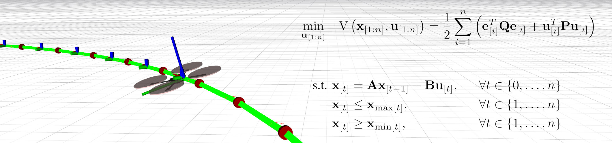

# MRS UAV Trackers



| Build status | [](https://github.com/ctu-mrs/mrs_uav_trackers/actions) |
|--------------|------------------------------------------------------------------------------------------------------------------------------------------------|

## Purpose of a tracker within the MRS control pipeline

* Receiving high-level references from a navigation software, those are generally
  * a single **position** + **heading** reference,
  * a trajectory, consisting of several **position** + **heading** references separated by a fixed time constant.
* Generating all-state and feasible reference for the [controllers](https://github.com/ctu-mrs/mrs_uav_controllers), which consists of
  * desired position, velocity, acceleration, heading, and heading rate.
* The trackers are provided with a set of state constraints that should be satisfied at all times.

## Available trackers

* "MPC tracker"
  * the main *workhorse* of the [MRS UAV System](https://github.com/ctu-mrs/mrs_uav_system), it is used for most of the regular flying
  * based on a unique *realtime simulated Model Predictive Control* approach
  * originally published in: `Baca, et al., "Model Predictive Trajectory Tracking and Collision Avoidance for Reliable Outdoor Deployment of Unmanned Aerial Vehicles", IROS 2018`, [link](http://mrs.felk.cvut.cz/data/papers/baca-mpc-tracker.pdf)
  * produces feasible reference which is smooth up to snap and satisfies given state constraints.
  * can smoothly track trajectories
  * can efficiently stop a UAV from any previous motion
  * can be activated in mid-flight while in motion
* "Speed tracker"
  * subscribes a [custom message](https://ctu-mrs.github.io/mrs_msgs/msg/SpeedTrackerCommand.html) containing a desired speed/acceleration, height, and heading
  * forwards the commands to the controllers unchanged
  * can not follow trajectories or react to references
  * should be activated only in hover
  * check the [tutorial](https://ctu-mrs.github.io/docs/system/speed_tracker.html)
* "Landoff tracker"
  * particular variant of *Line Tracker* used only for landing and takeoff
  * can not fly to the desired reference nor follow a trajectory
  * can efficiently stop UAV from the previous motion
  * has special *admittance* properties while landing and taking off to provide robustness
  * is also used for emergency landings and estops
* "Joy tracker"
  * provides control using a ROS-compatible joysticks
  * subscribes to `/joy` topic
  * tracks *height* and *heading*, the desired tilt is provided directly by a joystick
* "Matlab Tracker"
  * similar to *Speed tracker*, but the subscribed topic is a standard (not custom) ROS message since Matlab can not publish custom messages
* "Line tracker"
  * very simple tracker used mostly for debugging and testing
  * can fly to reference points
  * cannot track trajectories
  * the resulting reference is not smooth
  * can be used on a real UAV with caution, will induce spikes in tilt control
  * can stop a UAV from the previous motion
  * can be activated in mid-flight while in motion
  * **don't use on a real UAV**, kept around for debugging purposes

## Tracker interface

The trackers are compiled as *ROS plugins* ([http://wiki.ros.org/pluginlib](http://wiki.ros.org/pluginlib)) with the [interface](https://github.com/ctu-mrs/mrs_uav_managers/blob/master/include/mrs_uav_managers/tracker.h) defined by the [control manager](https://github.com/ctu-mrs/mrs_uav_managers).
A tracker from any ROS package can be loaded dynamically by the [control manager](https://github.com/ctu-mrs/mrs_uav_managers) without it being present during [control manager](https://github.com/ctu-mrs/mrs_uav_managers)'s compile time.
Loaded trackers can be switched by the [control manager](https://github.com/ctu-mrs/mrs_uav_managers) in mid-flight, which allows safe testing of new trackers and adds flexibility the [MRS UAV system](https://github.com/ctu-mrs/mrs_uav_system).

## Loading trackers to [control manager](https://github.com/ctu-mrs/mrs_uav_managers)

Trackers are defined in `trackers.yaml` ([example](https://github.com/ctu-mrs/mrs_uav_managers/blob/master/config/default/trackers.yaml)).
Each entry such as
```yaml
MpcTracker:
  address: "mrs_uav_trackers/MpcTracker"
```
creates an instance of a tracker; in this case, `mrs_uav_trackers/MpcTracker` is loaded under the *alias* `MpcTracker`.
Multiple instances are allowed and are used to introduce the same tracker with various configurations that can be switched in mid-flight.
Once the controller alias is defined within `trackers.yaml`, it needs to be part of the *trackers* list within `control_manager.yaml` ([example](https://github.com/ctu-mrs/mrs_uav_managers/blob/master/config/default/control_manager.yaml)) config:
```yaml
# - list of names of dynamically loaded trackers
trackers : [
  "MpcTracker",
  "LineTracker",
  "LandoffTracker",
  "JoyTracker",
  "NullTracker",
  "SpeedTracker",
]
```
Only the trackers within this list are actually loaded.
Switching to a tracker with the alias *MpcTracker* is done by calling a service:
```bash
rosservice call /uav1/control_manager/switch_tracker SpeedTracker
```
